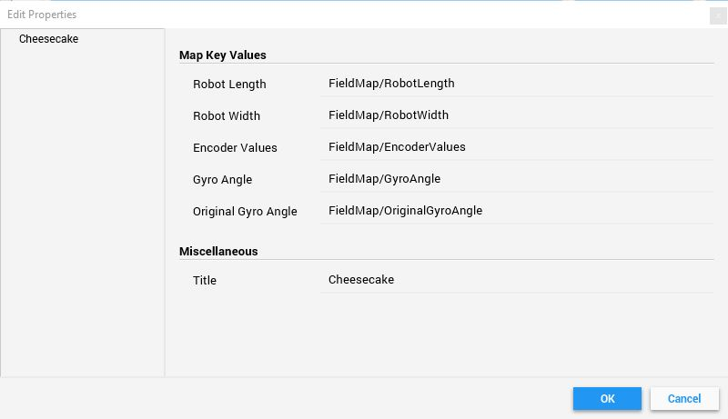

# FRC-2019 MAP WIDGET CHEESECAKE

## Necessary Variables

Create a Network Table that includes the values for the enceer distance, gyro angle, original gyro angle, robot length, 
robot width, and also a sendable chooser that includes the values of all the 
Then set all of the properties in the widget titled Cheesecake to reflect the shuffleboard values that you just added.

Example code on Stuypulse 694 (Robot.java):
```java
public class Robot extends TimedRobot {
    
    //Global Variables
    NetworkTable fieldMapTable;
    NetworkTableEntry encoderDist;
    NetworkTableEntry gyroAngle;
    NetworkTableEntry origGyroAngle;
    NetworkTableEntry robotLength;
    NetworkTableEntry robotWidth;
    NetworkTableEntry startPosition;
    SendableChooser<double[]> startPositionChooser;
    
    @Override
    public void robotInit() {
        fieldMapTable = NetworkTableInstance.getDefault().getTable("FieldMap");
        encoderDist = fieldMap.getEntry("EncoderValues");
        gyroAngle = fieldMap.getEntry("GyroAngle");
        origGyroAngle = fieldMap.getEntry("OriginalGyroAngle"); //Gyro angle at the start of match
        robotLength = fieldMap.getEntry("RobotLength");
        robotWidth = fieldMap.getEntry("RobotWidth");
        startPosition = fieldMap.getEntry("StartPosition")
        Shuffleboard.getTab("Field Map")
            .add("Start Position", startPositionChooser)
            .buildInto(fieldMapTable, fieldMapTable.getSubtable("Start Position"));
        startPositionChooser.addOption("Right Cargo Ship", new double[] {73, 326, 0});
        startPositionChooser.addOption("Middle", new double[] {127, 254, 0});
        startPositionChooser.addOption("Left Cargo Ship", new double[] {73, 182, 0});
        origGyroAngle.setDouble(drivetrain.getGyroAngle());
        robotLength.setDefaultDouble(35.0);
        robotWidth.setDefaultDouble(24.0);
    }
    
    @Override
    public void robotPeriodic() {
        startPosition.setValue(startPositionChooser.getSelected());
        encoderDist.setDouble(drivetrain.getGreyhillDistance());
        gyroAngle.setDouble(drivetrain.getGyroAngle());
    }
    
}
```

